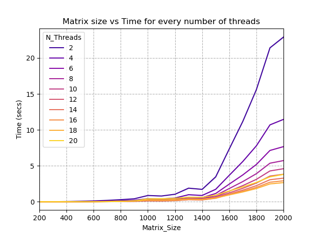

# Parallel matrix multiplication

Performance tests for parallel matrix multiplication algorithms.

## Usage

1. Install the required python libraries, found in `requirements.txt`. The following command shows how to do it using `pip`, but `conda` or any package manager can also be used.

```shell
pip install -r requirements.txt
```

2. Build the matrix multiplication executable using `make`.

```shell
cd MatMult
make
```

3. Run the experiments using the launcher.

```shell
cd ..
python launcher.py
```

4. Generate the graphics.

```shell
python graphics.py experiments.csv results.png
```

## Results

The experimentation results are summarized in the following figure.



In this case, the experiments were run in a ml.c5.9xlarge AWS instance, with 36 vCPUs and 72 GiB RAM. Every matrix size - number of threads combination was executed 30 times, in order to make the experiments statistically significant. The values in the graphic represent the mean values of those 30 repetitions.
